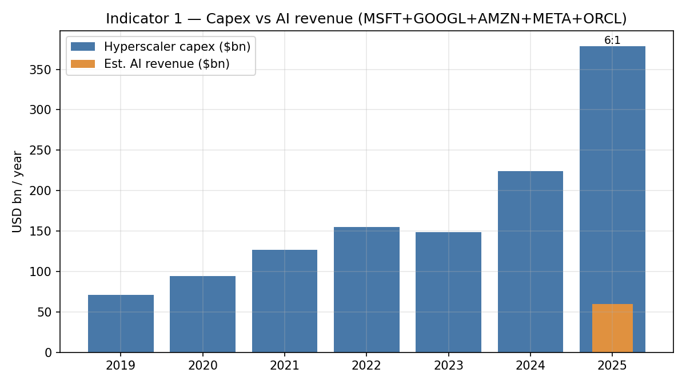
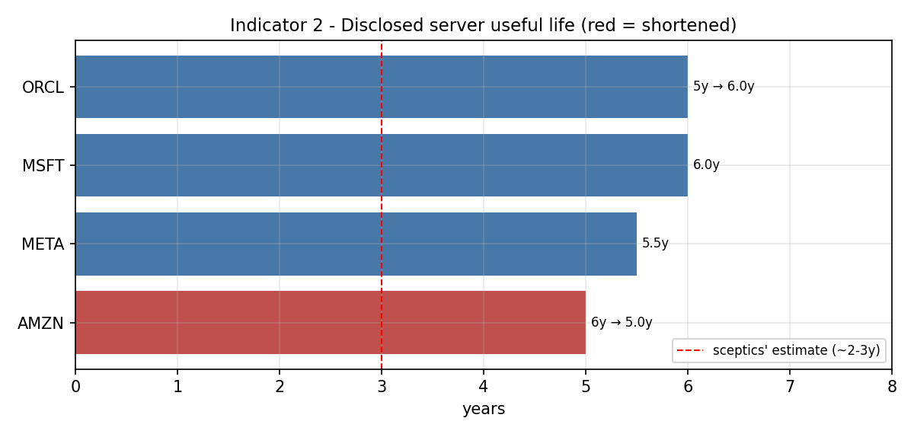
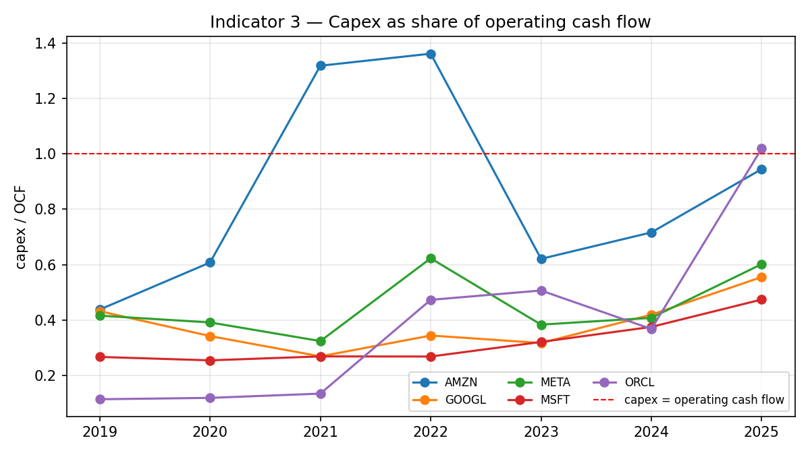
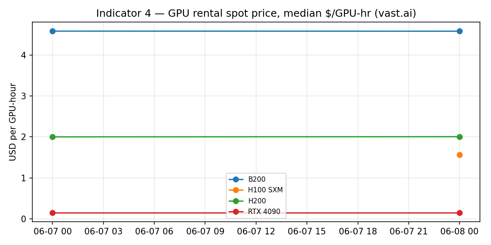
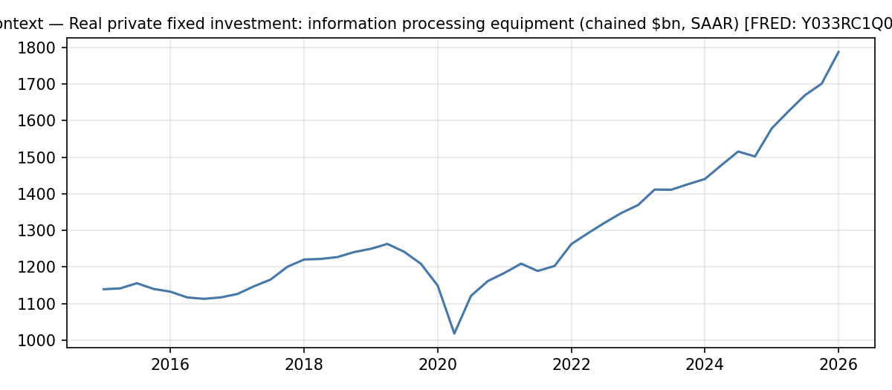
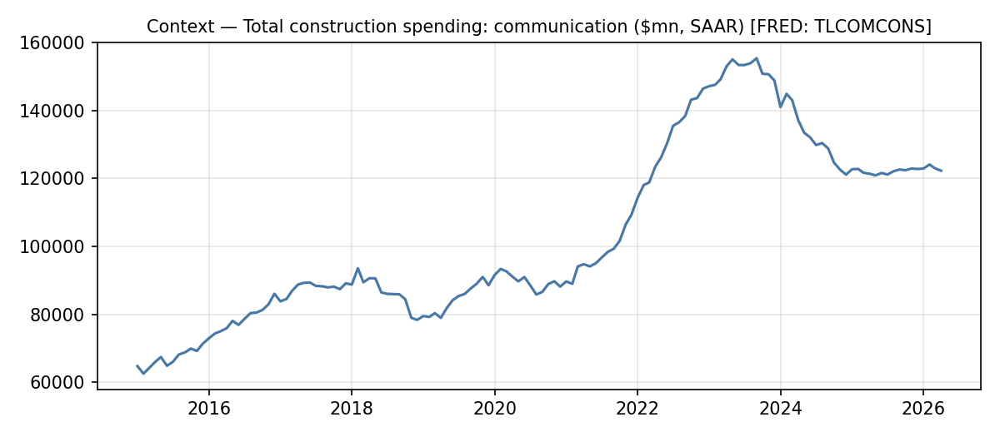

# AI boom indicators

*Last refresh: 2026-06-08*

Four falsifiable indicators of whether the AI investment boom is being
financed in a way that can absorb disappointment. Companion to chapter 9
of [The Price of Thinking](https://priceofthinking.com/chapters/the-boom/).
Data: SEC EDGAR (XBRL + 10-K text), FRED, vast.ai marketplace. Updated
automatically; every number traceable to a public primary source.

